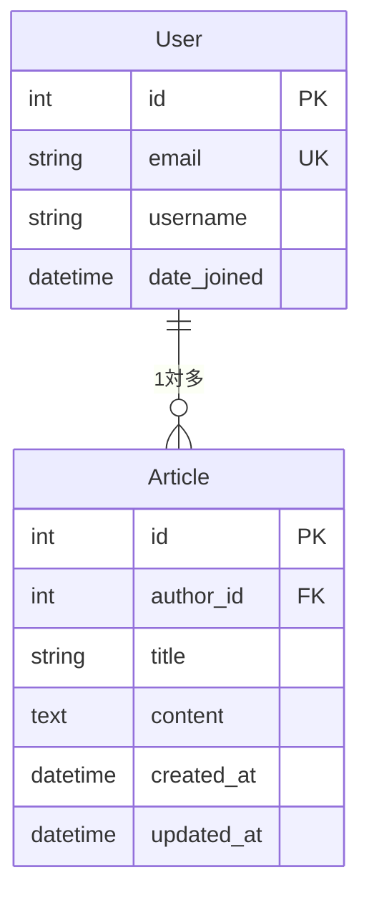

# 記事CRUD機能 - 設計書

## 概要

本設計書は、プログラミング初学者向けの学習アプリケーションとして、記事のCRUD機能をチャプター形式で段階的に実装するための技術設計を定義します。既存のDjangoプロジェクト（jazz_guitarist_paper）に新しいアプリケーション「articles」を追加し、学習体験を重視した実装を行います。

## アーキテクチャ

### システム構成

```
jazz_guitarist_paper/
├── articles/                    # 新規作成するアプリケーション
│   ├── models.py               # 記事モデル
│   ├── views.py                # ビューロジック
│   ├── forms.py                # フォーム定義
│   ├── urls.py                 # URL設定
│   ├── admin.py                # 管理画面設定
│   ├── templates/articles/     # テンプレート
│   └── migrations/             # マイグレーションファイル
├── templates/                  # 既存のテンプレートディレクトリ
├── accounts/                   # 既存のユーザー管理アプリ
└── tribute/                    # 既存のトリビュートアプリ
```

### MVCパターンの適用

- **Model**: Articleモデル（データ層）
- **View**: 関数ベースビュー → クラスベースビューへの段階的移行（ビジネスロジック層）
- **Template**: HTMLテンプレート（プレゼンテーション層）

### ビュー設計方針

初学者の学習効果を最大化するため、以下の段階的アプローチを採用：

1. **Phase 1 (Chapter 1-3)**: 関数ベースビュー（FBV）
   - 処理の流れが明確で理解しやすい
   - デバッグが容易
   - 基本概念の習得に集中

2. **Phase 2 (Chapter 4-6)**: クラスベースビュー（CBV）への移行
   - コードの再利用性向上
   - Django標準のベストプラクティス
   - より実践的な開発手法の習得

## コンポーネントと インターフェース

### 1. データモデル（articles/models.py）

```python
from django.db import models
from django.contrib.auth import get_user_model
from django.urls import reverse

User = get_user_model()

class Article(models.Model):
    author = models.ForeignKey(
        User, 
        on_delete=models.CASCADE,
        verbose_name="投稿者"
    )
    title = models.CharField(
        max_length=200,
        verbose_name="タイトル"
    )
    content = models.TextField(
        verbose_name="内容"
    )
    created_at = models.DateTimeField(
        auto_now_add=True,
        verbose_name="作成日時"
    )
    updated_at = models.DateTimeField(
        auto_now=True,
        verbose_name="更新日時"
    )

    class Meta:
        ordering = ['-created_at']
        verbose_name = "記事"
        verbose_name_plural = "記事"

    def __str__(self):
        return self.title

    def get_absolute_url(self):
        return reverse('articles:detail', kwargs={'pk': self.pk})
```

### 2. フォーム定義（articles/forms.py）

```python
from django import forms
from .models import Article

class ArticleForm(forms.ModelForm):
    class Meta:
        model = Article
        fields = ['title', 'content']
        widgets = {
            'title': forms.TextInput(attrs={
                'class': 'form-input',
                'placeholder': 'タイトルを入力してください'
            }),
            'content': forms.Textarea(attrs={
                'class': 'form-textarea',
                'rows': 10,
                'placeholder': '記事の内容を入力してください'
            })
        }
        
    def clean_title(self):
        title = self.cleaned_data.get('title')
        if not title:
            raise forms.ValidationError('タイトルは必須です')
        if len(title) > 200:
            raise forms.ValidationError('タイトルは200文字以内で入力してください')
        return title
        
    def clean_content(self):
        content = self.cleaned_data.get('content')
        if not content:
            raise forms.ValidationError('内容は必須です')
        return content
```

### 3. ビュー設計（articles/views.py）

#### Phase 1: 関数ベースビュー（Chapter 1-3）

##### 記事一覧ビュー
```python
def article_list(request):
    articles = Article.objects.all()
    return render(request, 'articles/list.html', {'articles': articles})
```

##### 記事詳細ビュー
```python
def article_detail(request, pk):
    article = get_object_or_404(Article, pk=pk)
    return render(request, 'articles/detail.html', {'article': article})
```

##### 記事作成ビュー
```python
@login_required
def article_create(request):
    if request.method == 'POST':
        form = ArticleForm(request.POST)
        if form.is_valid():
            article = form.save(commit=False)
            article.author = request.user
            article.save()
            return redirect('articles:detail', pk=article.pk)
    else:
        form = ArticleForm()
    return render(request, 'articles/create.html', {'form': form})
```

#### Phase 2: クラスベースビューへの移行（Chapter 4-6）

##### 記事編集ビュー（CBV版）
```python
from django.contrib.auth.mixins import LoginRequiredMixin
from django.views.generic import UpdateView
from django.contrib import messages

class ArticleUpdateView(LoginRequiredMixin, UpdateView):
    model = Article
    form_class = ArticleForm
    template_name = 'articles/edit.html'
    
    def dispatch(self, request, *args, **kwargs):
        article = self.get_object()
        if article.author != request.user:
            return redirect('articles:detail', pk=article.pk)
        return super().dispatch(request, *args, **kwargs)
    
    def form_valid(self, form):
        messages.success(self.request, '記事を更新しました')
        return super().form_valid(form)
```

##### 記事削除ビュー（CBV版）
```python
from django.views.generic import DeleteView
from django.urls import reverse_lazy

class ArticleDeleteView(LoginRequiredMixin, DeleteView):
    model = Article
    template_name = 'articles/delete.html'
    success_url = reverse_lazy('articles:list')
    
    def dispatch(self, request, *args, **kwargs):
        article = self.get_object()
        if article.author != request.user:
            return redirect('articles:detail', pk=article.pk)
        return super().dispatch(request, *args, **kwargs)
    
    def delete(self, request, *args, **kwargs):
        messages.success(request, '記事を削除しました')
        return super().delete(request, *args, **kwargs)
```

### 4. URL設計（articles/urls.py）

```python
from django.urls import path
from . import views

app_name = 'articles'

urlpatterns = [
    path('', views.article_list, name='list'),
    path('<int:pk>/', views.article_detail, name='detail'),
    path('create/', views.article_create, name='create'),
    path('<int:pk>/edit/', views.article_edit, name='edit'),
    path('<int:pk>/delete/', views.article_delete, name='delete'),
]
```

## データモデル

### Articleモデルの詳細設計

| フィールド名 | データ型 | 制約 | 説明 |
|-------------|----------|------|------|
| id | BigAutoField | PRIMARY KEY | 自動生成ID |
| author | ForeignKey | NOT NULL, CASCADE | 投稿者（Userモデルへの外部キー） |
| title | CharField(200) | NOT NULL | 記事タイトル |
| content | TextField | NOT NULL | 記事内容 |
| created_at | DateTimeField | NOT NULL, auto_now_add | 作成日時 |
| updated_at | DateTimeField | NOT NULL, auto_now | 更新日時 |

### データベース関係図



## エラーハンドリング

### 1. バリデーションエラー
- フォームレベルでのバリデーション
- フィールドレベルでのカスタムバリデーション
- ユーザーフレンドリーなエラーメッセージ

### 2. 権限エラー
- 未ログインユーザーのアクセス制御
- 他人の記事への不正アクセス防止
- 適切なリダイレクト処理

### 3. 404エラー
- 存在しない記事へのアクセス
- カスタム404ページの表示

### 4. デバッグ支援
- DEBUG=Trueでの詳細エラー表示
- ログ出力による問題追跡
- 開発者向けエラー情報

## テスト戦略

### 1. 単体テスト
- モデルのバリデーションテスト
- フォームのバリデーションテスト
- ビューの基本動作テスト

### 2. 統合テスト
- ユーザー認証フローのテスト
- CRUD操作の完全なフローテスト
- 権限制御のテスト

### 3. UIテスト
- テンプレートの表示確認
- フォームの動作確認
- ナビゲーションの確認

## チュートリアル学習設計

### チャプター構成

#### Chapter 1: モデルとマイグレーション
- **学習目標**: Djangoモデルの基本概念とデータベース設計
- **実装内容**: Articleモデルの作成とマイグレーション
- **学習ポイント**: 
  - モデルフィールドの種類と使い方
  - 外部キーの概念
  - マイグレーションの仕組み

#### Chapter 2: 記事一覧表示
- **学習目標**: ビューとテンプレートの基本
- **実装内容**: 記事一覧ページの作成
- **学習ポイント**: 
  - QuerySetの使い方
  - テンプレートの継承
  - URLパターンの設定

#### Chapter 3: 記事投稿とバリデーション
- **学習目標**: フォーム処理とデータ検証
- **実装内容**: 記事作成フォームとバリデーション
- **学習ポイント**: 
  - ModelFormの使い方
  - バリデーションの実装
  - CSRFトークンの理解

#### Chapter 4: 記事詳細表示
- **学習目標**: 動的URL処理と条件分岐
- **実装内容**: 記事詳細ページと権限表示
- **学習ポイント**: 
  - URLパラメータの処理
  - テンプレートでの条件分岐
  - get_object_or_404の使い方

#### Chapter 5: 記事編集と更新（CBVへの移行）
- **学習目標**: クラスベースビューとデータ更新
- **実装内容**: FBVからCBVへの移行と記事編集機能
- **学習ポイント**: 
  - クラスベースビューの基本概念
  - UpdateViewの使い方
  - Mixinによる機能拡張
  - FBVとCBVの比較

#### Chapter 6: デバッグと記事削除（CBV完全移行）
- **学習目標**: エラー処理とCBVマスター
- **実装内容**: DeleteViewと総合的なエラーハンドリング
- **学習ポイント**: 
  - DeleteViewの実装
  - CBVでのカスタマイズ方法
  - デバッグ技術
  - 実践的なDjango開発手法

### 学習支援機能

#### 1. ステップバイステップガイド
- 各チャプターでの明確な手順
- コードの説明とコメント
- 実行結果の確認方法

#### 2. エラー解説
- よくあるエラーとその解決方法
- デバッグのヒント
- 学習者向けの分かりやすい説明

#### 3. 発展的な学習
- 各チャプター完了後の追加課題
- 関連する概念の紹介
- 次のステップへの導線

## セキュリティ考慮事項

### 1. 認証・認可
- ログイン必須機能の適切な保護
- 投稿者以外のアクセス制限
- セッション管理

### 2. データ保護
- CSRFトークンによる攻撃防止
- SQLインジェクション対策（ORMによる自動対策）
- XSS対策（テンプレートエスケープ）

### 3. 入力検証
- フォームバリデーション
- データ型チェック
- 文字数制限

## パフォーマンス考慮事項

### 1. データベースクエリ最適化
- 必要最小限のフィールド取得
- N+1問題の回避（select_related使用）
- インデックスの適切な設定

### 2. テンプレート最適化
- テンプレート継承による重複排除
- 静的ファイルの効率的な配信
- キャッシュ戦略（将来的な拡張）

## 技術スタック

- **フレームワーク**: Django 5.2.6
- **データベース**: SQLite3（開発環境）
- **テンプレートエンジン**: Django Templates
- **CSS フレームワーク**: Tailwind CSS
- **認証**: Django標準認証システム
- **フォーム**: Django Forms